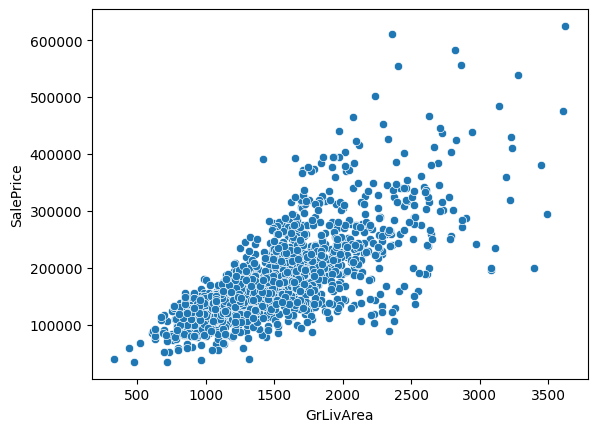
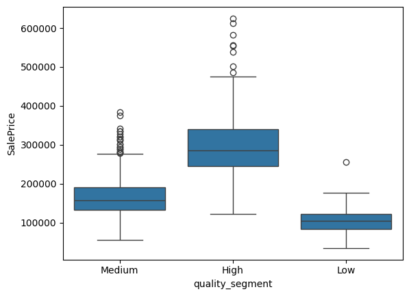
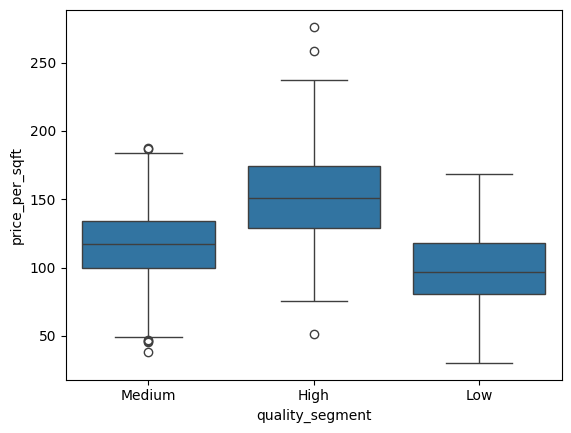
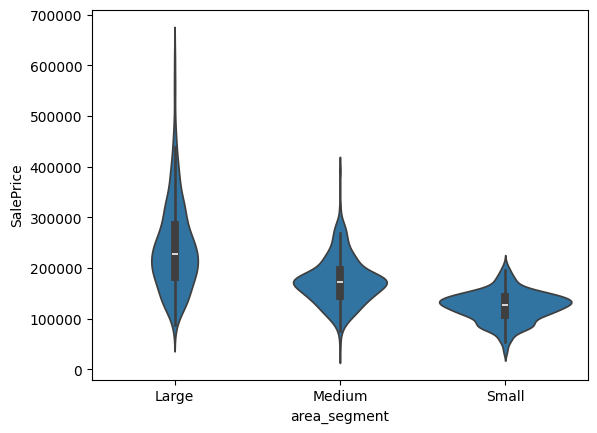

## EDA report

## Hour 8
1. Title
House Price Analysis - EDA Report

2. Objective
To analyse factors affecting house prices and extract meaningful
insights

3. Dataset Overview
Dataset containes housing featues like area,quality,location
and price

Key Insights
1. House prices increases with living area, showing strong
relation
2. Higher quality houses consistently have higher median prices.
3. Price per square foot increases with quality,
indicating premium valuation
4. Large and high-quality houses dominate the premium price segment.


```python
import pandas as pd
df = pd.read_csv('house_price_v4_final.csv')
df.head()
```


<div>
<style scoped>
    .dataframe tbody tr th:only-of-type {
        vertical-align: middle;
    }

    .dataframe tbody tr th {
        vertical-align: top;
    }

    .dataframe thead th {
        text-align: right;
    }
</style>
<table border="1" class="dataframe">
  <thead>
    <tr style="text-align: right;">
      <th></th>
      <th>Unnamed: 0</th>
      <th>Id</th>
      <th>MSSubClass</th>
      <th>MSZoning</th>
      <th>LotFrontage</th>
      <th>LotArea</th>
      <th>Street</th>
      <th>LotShape</th>
      <th>LandContour</th>
      <th>Utilities</th>
      <th>...</th>
      <th>price_diff</th>
      <th>area_rank</th>
      <th>avg_area</th>
      <th>price_per_sqft</th>
      <th>TotalSF</th>
      <th>overall_score</th>
      <th>premium_flag</th>
      <th>price_segment</th>
      <th>area_segment</th>
      <th>quality_segment</th>
    </tr>
  </thead>
  <tbody>
    <tr>
      <th>0</th>
      <td>0</td>
      <td>1</td>
      <td>60</td>
      <td>RL</td>
      <td>65.0</td>
      <td>8450</td>
      <td>Pave</td>
      <td>Reg</td>
      <td>Lvl</td>
      <td>AllPub</td>
      <td>...</td>
      <td>10534.226667</td>
      <td>102.0</td>
      <td>1480.500000</td>
      <td>121.929825</td>
      <td>2566</td>
      <td>11970</td>
      <td>1</td>
      <td>High</td>
      <td>Large</td>
      <td>Medium</td>
    </tr>
    <tr>
      <th>1</th>
      <td>1</td>
      <td>2</td>
      <td>20</td>
      <td>RL</td>
      <td>80.0</td>
      <td>9600</td>
      <td>Pave</td>
      <td>Reg</td>
      <td>Lvl</td>
      <td>AllPub</td>
      <td>...</td>
      <td>-57272.727273</td>
      <td>3.0</td>
      <td>1539.636364</td>
      <td>143.819334</td>
      <td>2524</td>
      <td>7572</td>
      <td>0</td>
      <td>Medium</td>
      <td>Medium</td>
      <td>Medium</td>
    </tr>
    <tr>
      <th>2</th>
      <td>2</td>
      <td>3</td>
      <td>60</td>
      <td>RL</td>
      <td>68.0</td>
      <td>11250</td>
      <td>Pave</td>
      <td>IR1</td>
      <td>Lvl</td>
      <td>AllPub</td>
      <td>...</td>
      <td>25534.226667</td>
      <td>114.5</td>
      <td>1480.500000</td>
      <td>125.139978</td>
      <td>2706</td>
      <td>12502</td>
      <td>1</td>
      <td>High</td>
      <td>Large</td>
      <td>Medium</td>
    </tr>
    <tr>
      <th>3</th>
      <td>3</td>
      <td>4</td>
      <td>70</td>
      <td>RL</td>
      <td>60.0</td>
      <td>9550</td>
      <td>Pave</td>
      <td>IR1</td>
      <td>Lvl</td>
      <td>AllPub</td>
      <td>...</td>
      <td>-70624.725490</td>
      <td>26.0</td>
      <td>1791.607843</td>
      <td>81.537566</td>
      <td>2473</td>
      <td>12019</td>
      <td>0</td>
      <td>Medium</td>
      <td>Large</td>
      <td>Medium</td>
    </tr>
    <tr>
      <th>4</th>
      <td>4</td>
      <td>5</td>
      <td>60</td>
      <td>RL</td>
      <td>84.0</td>
      <td>14260</td>
      <td>Pave</td>
      <td>IR1</td>
      <td>Lvl</td>
      <td>AllPub</td>
      <td>...</td>
      <td>-64028.410256</td>
      <td>11.0</td>
      <td>2412.076923</td>
      <td>113.739763</td>
      <td>3343</td>
      <td>17584</td>
      <td>0</td>
      <td>High</td>
      <td>Large</td>
      <td>High</td>
    </tr>
  </tbody>
</table>
<p>5 rows × 91 columns</p>
</div>


```python
## Add suppporting visualizations
# 1. Insight 1
import seaborn as sns
sns.scatterplot(x='GrLivArea', y='SalePrice', data=df)
```


    <Axes: xlabel='GrLivArea', ylabel='SalePrice'>


    

    


```python
# 2. Insight 2
sns.boxplot(x='quality_segment', y='SalePrice', data=df)
```


    <Axes: xlabel='quality_segment', ylabel='SalePrice'>


    

    


```python
## Insight 3
sns.boxplot(x='quality_segment', y='price_per_sqft', data=df)
```


    <Axes: xlabel='quality_segment', ylabel='price_per_sqft'>


    

    


```python
sns.violinplot(x='area_segment', y='SalePrice', data=df)
```


    <Axes: xlabel='area_segment', ylabel='SalePrice'>


    

    


## Final Story
The analysis indicates that house prices are primarily driven by
living area and construction quality. Larger and high-quality houses
consistently fall into premium segments, while smaller and lower-quality
houses remain in lower price ranges. Additionally, price efficiency
increases with quality, suggesting that buyers are willing to pay more
for better-built homes. The market shows clear segmentation with
balanced distribution across price categories.

Business Recommendation :-

Builder should focus on improving quality and optimising space to maximise property value and target premium segment.
